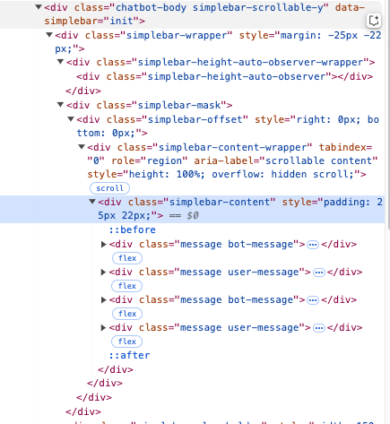

 
 
查看node版本18+或者20就ok。   node  -v


npm create vite@latest ./ChatBot --template react
本次开发只用了react和JavaScript，没有用ts。
进入项目的根目录下安装依赖npm install
之后启动项目npm  run dev


# react引入iconfont图标
通过 Symbol 引入 Iconfont
1. 在 Iconfont 上选择图标并生成 Symbol 代码，在 Iconfont 项目页面，选择“Symbol”方式。点击“生成代码”并复制生成的 JavaScript 链接。

2. 在 React 项目中引入 Symbol
在组件中使用图标：
```
const MyComponent = () => {
  return (
    <div>
      <svg className="icon" aria-hidden="true">
        <use xlinkHref="#icon-图标名称"></use>
      </svg>
    </div>
  );
};

export default MyComponent;
```
#icon-图标名称 是你在 Iconfont 上选择的图标的 ID。

# React引入 Material Symbols图标
选择图标，右侧点击static icon font的copy code复制到index.html的title下面
之后点击Inserting the icon的copy code将代码复制到组件中即可。可以对标签进行修改，比如span修改为button。

# 兼容所有浏览器使用js库实现自定义滚动条
## 安装simpleBar
```
npm install simplebar
```
最初没注意终端目录，安装错了地方所以一直没有生效……

## 使用simpleBar
```
<div data-simplebar>
  <div class="content">
    <!-- 你的内容 -->
  </div>
</div>
```
这个我的理解就是在聊天内容的容器中设置data-simplebar就可以了。
还需要在main.jsx中导入simpleBar的css文件，并完成初始化。
```
import SimpleBar from 'simplebar';
new SimpleBar(document.querySelector('chatbot-body')); 
```
## 检查SimpleBar是否正确生成滚动条
SimpleBar 会在容器内部生成滚动条元素。打开浏览器的开发者工具（按 F12），检查 DOM 结构，确认 SimpleBar 是否正确生成了滚动条元素。

滚动条元素：.simplebar-scrollbar 是滚动条的实际元素。

滚动条轨道：.simplebar-track 是滚动条的轨道。

如果 DOM 中没有生成这些元素，说明 SimpleBar 可能没有正确初始化。
## 在css中设置容器高度
```
[data-simplebar] {
  height: 300px; /* 设置容器高度 */
  width: 100%; /* 设置容器宽度 */
}
```
## 设置滚动条样式

SimpleBar 会自动生成自定义滚动条，你可以通过 CSS 修改其样式：

```css

.simplebar-scrollbar::before {
  background-color: #888; /* 滚动条颜色 */
  border-radius: 6px; /* 滚动条圆角 */
}

.simplebar-scrollbar:hover::before {
  background-color: #555; /* 滚动条悬停颜色 */
}
```


# 关于输入框
input和button弹性布局，form背景色白色，看起来button是放在input里面了，实际并不是。


