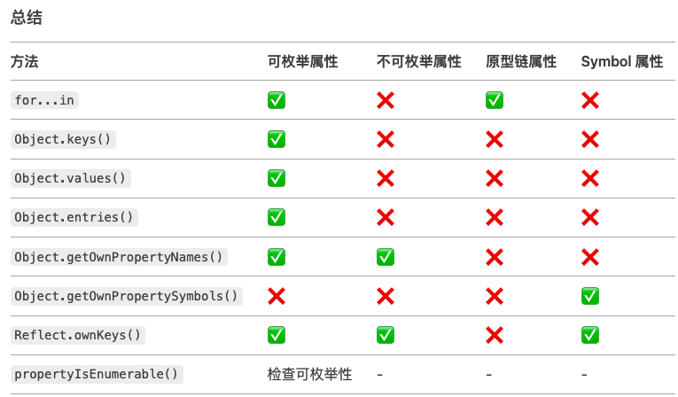

# 前言
在JavaScript中，对象的属性可以分为可枚举属性和不可枚举属性。两者的区别在于是否可以通过for...in循环、Object.keys()、Object.entries()、Object.getOwnPropertyNames()等方法遍历到。

# 可枚举属性
可枚举属性是指可以通过for...in循环、Object.keys()、Object.getOwnPropertyNames()等方法遍历到的属性。默认情况下，对象的属性都是可枚举的。

```javascript
const person={
  name:'Jack',
  age:18,
  color:'yellow'
}
//给person对象添加一个可枚举属性gender
Object.defineProperty(person,'gender',{
  value:'male',
  enumerable:true,//设置为可枚举
});
console.log('可枚举属性gender',Object.keys(person));//["name", "age", "color", "gender"]

//给person对象添加一个不可枚举属性save
Object.defineProperty(person,'save',{
  value:'0.1',
  enumerable:false,//设置为不可枚举
})
console.log('不可枚举属性save',Object.keys(person));
```

## 常见的可枚举属性
1. 对象字面量中直接定义的属性（默认是可枚举的）。

2. Object.defineProperty 中 enumerable: true ，属性就是可枚举的。

# 不可枚举属性
不可枚举属性是指那些无法通过 for...in 循环、Object.keys 等方法遍历到的属性。它们通常是对象的内置属性或通过 Object.defineProperty 显式设置为 enumerable: false 的属性。
## 常见的不可枚举属性
1. 对象的原型属性（如 Object.prototype 上的方法）。

2.  Object.defineProperties 设置为 enumerable: false 的属性。

3. 内置对象的属性和方法（如 Array.prototype 上的方法）。

# 如何区分可枚举属性和不可枚举属性
## 遍历可枚举属性
### Object.keys(对象)
返回一个包含对象自身可枚举属性的数组。
```javascript
const obj = {
  name: "Alice",
  age: 25,
};

Object.defineProperty(obj, "password", {
  value: "123456",
  enumerable: false,
});

console.log(Object.keys(obj)); // ["name", "age"]
```
### Object.values(对象)
返回一个包含对象自身可枚举属性的值数组。
```javascript
console.log(Object.values(obj)); // ["Alice", 25]
```
### for in 循环
遍历对象自身的和继承的可枚举属性。

```javascript
for (const key in obj) {
  console.log(key); // "name", "age"
}
```
### Object.entries(对象)
返回一个包含对象自身可枚举属性的键值对数组。
```javascript
console.log(Object.entries(obj)); // [["name", "Alice"], ["age", 25]]
```
## 遍历不可枚举属性
### Object.getOwnPropertyNames(对象)
返回一个包含对象自身所有属性的数组，包括可枚举属性和不可枚举属性。

```javascript
console.log(Object.getOwnPropertyNames(obj)); // ["name", "age", "password"]
```
### Object.getOwnPropertySymbols(对象)
返回一个包含对象自身所有 Symbol 属性的数组，包括可枚举属性和不可枚举属性。

```javascript
const sym = Symbol("id");
const obj = { name: "Alice", [sym]: 123 };
Object.defineProperty(obj, "age", { value: 25, enumerable: false });

console.log(Object.getOwnPropertySymbols(obj)); // 输出 [Symbol(id)]
```
### Reflect.ownKeys(对象)
返回对象的所有属性包括可枚举属性、不可枚举属性、Symbol 属性。
```javascript
const sym = Symbol("id");
const obj = { name: "Alice", [sym]: 123 };
Object.defineProperty(obj, "age", { value: 25, enumerable: false });

console.log(Reflect.ownKeys(obj)); // 输出 ["name", "age", Symbol(id)]
```
## 检查属性是否可枚举
### propertyIsEnumerable(对象, 属性) 
判断对象自身属性是否可枚举。

```javascript
console.log(obj.propertyIsEnumerable("name")); // true
console.log(obj.propertyIsEnumerable("password")); // false
```
## 遍历可枚举属性和不可枚举属性
### Object.getOwnPropertyDescriptors(对象)
返回一个对象，其中包含了对象自身所有属性的描述符，包括可枚举属性和不可枚举属性。

```javascript
Object.getOwnPropertyDescriptor(查找特定属性所在对象, 属性)
```
# 总结
可枚举属性是能被for in 循环、Object.keys()、Object.entries()、Object.getOwnPropertyNames()等方法遍历到的属性，而不可枚举属性则无法被这些方法遍历到。

