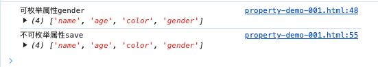

# 前言
在JavaScript中，对象的属性可以分为可枚举属性和不可枚举属性。两者的区别在于是否可以通过for...in循环、Object.keys()、Object.entries()、Object.getOwnPropertyNames()等方法遍历到。

# 可枚举属性
可枚举属性是指可以通过for...in循环、Object.keys()、Object.getOwnPropertyNames()等方法遍历到的属性。默认情况下，对象的属性都是可枚举的。

```javascript
const person={
  name:'Jack',
  age:18,
  color:'yellow'
}
//给person对象添加一个可枚举属性gender
Object.defineProperty(person,'gender',{
  value:'male',
  enumerable:true,//设置为可枚举
});
console.log('可枚举属性gender',Object.keys(person));//["name", "age", "color", "gender"]

//给person对象添加一个不可枚举属性save
Object.defineProperty(person,'save',{
  value:'0.1',
  enumerable:false,//设置为不可枚举
})
console.log('不可枚举属性save',Object.keys(person));
```

## 常见的可枚举属性
1. 对象字面量中直接定义的属性（默认是可枚举的）。

2. 使用 Object.defineProperty 或 Object.defineProperties 显式设置为 enumerable: true 的属性。

# 不可枚举属性
不可枚举属性是指那些无法通过 for...in 循环、Object.keys 等方法遍历到的属性。它们通常是对象的内置属性或通过 Object.defineProperty 显式设置为 enumerable: false 的属性。
## 常见的不可枚举属性
1. 对象的原型属性（如 Object.prototype 上的方法）。

2. 使用 Object.defineProperty 或 Object.defineProperties 显式设置为 enumerable: false 的属性。

3. 内置对象的属性和方法（如 Array.prototype 上的方法）。

# 如何区分可枚举属性和不可枚举属性